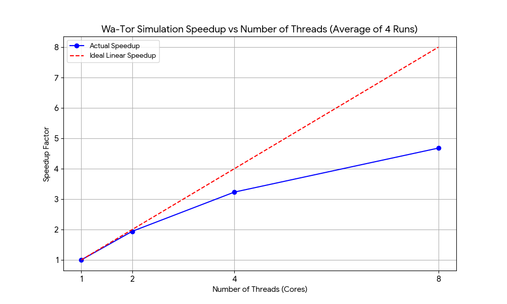

# Wa-Tor Simulation Project
https://github.com/hans1song/Wa-tor
## Overview
This project implements the "Wa-Tor" simulation as described by A.K. Dewdney in *Scientific American* ("Computer Recreations; Sharks and Fish wage an ecological war on the toroidal planet of Wa-Tor"). It simulates an ecological struggle between sharks and fish on a toroidal grid.

## Implementation
- **Language:** Go (Golang)
- **Graphics:** Ebiten library
- **Documentation:** Doxygen-style comments included in source.
* **Platform:** Cross-platform (including Windows)

## Building the Project

Ensure you have Go installed (version 1.18+ recommended).

1. **Initialize the module (if not already done):**
   ```bash
   go mod tidy
   ```

2. **Build the executable:**
   ```bash
   go build -o wator.exe main.go
   ```

## Usage

The simulation supports several command-line parameters to control the population and world properties.

### Parameters
| Flag | Description | Default |
|------|-------------|---------|
| `-sharks` | Starting population of sharks | 2000 |
| `-fish` | Starting population of fish | 3000 |
| `-fbreed` | Chronons before a fish can reproduce | 100 |
| `-sbreed` | Chronons before a shark can reproduce | 150 |
| `-starve` | Chronons a shark can go without food | 150 |
| `-width` | Width of the grid | 900 |
| `-height` | Height of the grid | 600 |
| `-threads` | Number of threads to use | (CPU logical count) |

### Examples

**Run with default settings (Graphical Mode):**
```bash
./wator.exe
```

**Run with custom population:**
```bash
./wator.exe -fish 5000 -sharks 1000 -width 1000 -height 800
```

## Experimental Report

### Benchmark Methodology
To measure the performance and parallel scaling of the simulation, a benchmark mode was implemented. This mode runs the simulation for a fixed number of chronons (2000) without rendering graphics to isolate the computational performance.

**Command used for benchmarking:**
```bash
./wator.exe -benchmark -threads <N> -chronons 2000 -width 900 -height 600 -fish 3000 -sharks 2000
```

### Results
The following table summarizes the average execution time over 4 independent runs for varying thread counts.

| Threads | Avg Time (s) | Speedup |
|---------|--------------|---------|
| 1       | 29.25s       | 1.00x   |
| 2       | 15.07s       | 1.94x   |
| 4       | 9.05s        | 3.23x   |
| 8       | 6.25s        | 4.68x   |

### Speedup Graph
The graph below illustrates the speedup achieved as the number of threads increases.



### Analysis
The simulation demonstrates significant performance gains with parallelization. 
- Moving from **1 to 2 threads** yields a near-linear speedup (~1.94x), indicating efficient work distribution and low overhead.
- At **4 threads**, the speedup is strong (3.23x), though slightly diminishing returns begin to appear.
- At **8 threads**, we achieve a 4.68x speedup. The scaling efficiency decreases at higher thread counts, likely due to synchronization overhead (e.g., atomic operations or memory bandwidth saturation) inherent in managing the shared grid state.

## License
This project is released under the MIT License.
